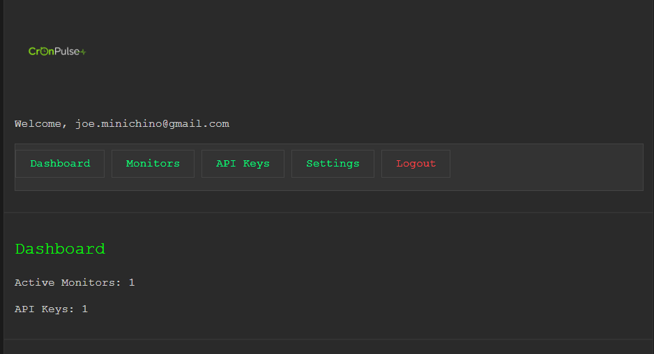
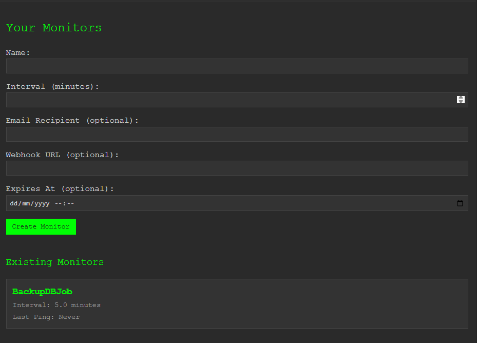
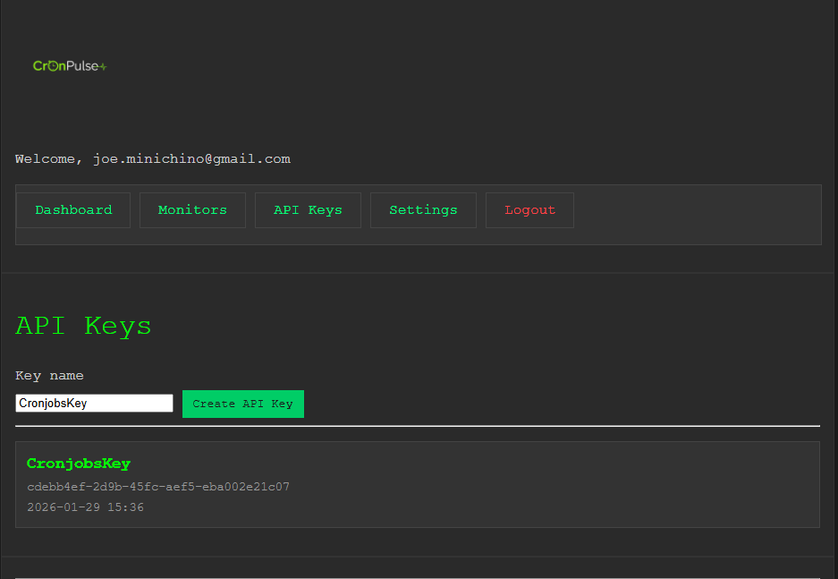

# CronPulse Community Edition 🔔

> **"Just tell me when it breaks."**

A lightweight, self-hosted monitoring solution for your background jobs, scheduled tasks, and automated services. Get instant alerts via email or webhooks when your critical processes fail to check in.

> 💼 Looking for managed hosting? Check out [CronPulse Pro](https://cronpulse.dev) for a fully hosted solution with additional features.

## Why CronPulse?

**Use Cases:**
- 📊 **Database Backups**: Know immediately if your nightly backup fails
- 🔄 **ETL Pipelines**: Monitor data processing jobs and workflows
- 🗂️ **Cleanup Tasks**: Track file rotation, log archival, temp directory cleaning
- 📧 **Email Campaigns**: Verify scheduled email jobs are running
- 🔧 **System Maintenance**: Monitor server health checks and automated updates
- ☁️ **Cloud Functions**: Track serverless cron jobs and scheduled lambdas

## Features

- 🎯 **Dead Simple**: Create a monitor, ping it from your job, get alerted if it doesn't ping
- 📧 **Flexible Alerts**: Email and webhook notifications when jobs miss their schedule
- 🔑 **API-First Design**: Full REST API with optional web UI
- 💾 **SQLite Database**: Zero-configuration embedded database
- 🐳 **Docker Ready**: Single-container deployment with persistent storage
- 🆓 **Open Source**: No subscriptions, no limits, fully self-hosted

## Screenshots

### Dashboard

*Monitor overview showing status and last ping times*

### Creating a Monitor

*Simple form to set up monitoring for your cron jobs*

### API Keys Management

*Generate API keys for programmatic access*

## Quick Start with Docker

### Using Docker Compose (Recommended)

1. **Clone the repository:**
```bash
git clone https://github.com/techfort/cronpulse-community.git
cd cronpulse-community
```

2. **Create environment file:**
```bash
cat > .env << EOF
JWT_SECRET=$(openssl rand -hex 32)
# Optional: Add SMTP settings for email alerts
# SMTP_HOST=smtp.gmail.com
# SMTP_PORT=587
# SMTP_USER=your-email@gmail.com
# SMTP_PASSWORD=your-app-password
# SENDER_EMAIL=your-email@gmail.com
EOF
```

3. **Start the service:**
```bash
docker-compose up -d
```

4. **Access the application:**
- Web UI: http://localhost:8000
- API: http://localhost:8000/api
- Documentation: http://localhost:8000/documentation

### Using Docker Hub Image (Easiest)

```bash
# Pull and run the pre-built image
docker run -d \
  -p 8000:8000 \
  -v cronpulse-data:/app/data \
  -e JWT_SECRET=$(openssl rand -hex 32) \
  --name cronpulse \
  cronpulse/cronpulse-community:latest
```

Then visit http://localhost:8000 to get started!

### Building from Source

```bash
# Build the image
docker build -t cronpulse-community .

# Run the container
docker run -d \
  -p 8000:8000 \
  -v cronpulse-data:/app/data \
  -e JWT_SECRET=$(openssl rand -hex 32) \
  --name cronpulse \
  cronpulse-community
```

## Local Development Setup

1. **Install dependencies:**
```bash
pip install -r requirements.txt
```

2. **Set environment variables:**
```bash
export JWT_SECRET=$(openssl rand -hex 32)
export DATABASE_URL=sqlite:///data/monitors.db
# Optional: Configure SMTP for email alerts
export SMTP_HOST=smtp.gmail.com
export SMTP_PORT=587
export SMTP_USER=your-email@gmail.com
export SMTP_PASSWORD=your-app-password
```

3. **Run the application:**
```bash
uvicorn main:app --reload
```

## Configuration

### Environment Variables

| Variable | Description | Default |
|----------|-------------|---------|
| `DATABASE_URL` | SQLite database path | `sqlite:///data/monitors.db` |
| `JWT_SECRET` | Secret key for JWT tokens | Required |
| `SMTP_HOST` | SMTP server hostname | Optional |
| `SMTP_PORT` | SMTP server port (587 or 465) | Optional |
| `SMTP_USER` | SMTP username | Optional |
| `SMTP_PASSWORD` | SMTP password | Optional |
| `SENDER_EMAIL` | Email sender address | Optional |
| `SENDER_NAME` | Email sender name | Optional |
| `SMTP_USE_TLS` | Use TLS for SMTP (true/false) | `true` |

### Email Setup

CronPulse uses SMTP for sending email alerts. **Email is optional** - you can skip this entirely and use webhook-only monitoring if you prefer to route alerts to Slack, Discord, PagerDuty, or other webhook-based services.

**Skip Email Setup:**
- During initial setup, check "Skip email configuration (I'll only use webhooks)"
- Create monitors with webhook URLs only
- Configure email alerts later if needed

**Configure Email Later:**
If you skipped email during setup, you can add it anytime by:
1. Stop the container: `docker compose down`
2. Edit `.env` and add SMTP variables (see examples below)
3. Restart: `docker compose up -d`

**Configure Email (Optional):**

**Gmail:**
1. Enable 2-factor authentication in your Google account
2. Create an [App Password](https://myaccount.google.com/apppasswords)
3. Configure environment variables:
   ```bash
   SMTP_HOST=smtp.gmail.com
   SMTP_PORT=587
   SMTP_USER=your-email@gmail.com
   SMTP_PASSWORD=your-app-password
   SENDER_EMAIL=your-email@gmail.com
   SENDER_NAME=CronPulse
   ```

**SendGrid, Mailgun, AWS SES:**
Configure with your provider's SMTP credentials. Most support standard SMTP on ports 587 (TLS) or 465 (SSL).

**Test your configuration:**
```bash
# Set your SMTP environment variables in .env first
python test_email.py your-email@example.com
```

## How to Use CronPulse

### Step 1: Initial Setup via Web UI

1. **Open your browser** and navigate to `http://localhost:8000`

2. **First-time setup:**
   - Create an admin account with email and password
   - Configure SMTP settings (optional - you can skip and use webhooks only)
   - If you skip email, you'll need webhook URLs for alerts

3. **Sign in** with your admin credentials

### Step 2: Configure Email Alerts (Optional)

If you skipped email during setup, you can configure it later:

1. Navigate to **Settings** in the UI
2. Fill in SMTP configuration:
   - **SMTP Host**: e.g., `smtp.gmail.com`
   - **SMTP Port**: `587` (TLS) or `465` (SSL)
   - **SMTP User**: Your email address
   - **SMTP Password**: Your email password or app password
   - **Sender Email**: From address for alerts
3. Click **Test Email** to verify configuration
4. Click **Save Settings**

**Gmail Users:** Enable 2FA and create an [App Password](https://myaccount.google.com/apppasswords)

### Step 3: Create an API Key

**Via Web UI:**
1. Click on **API Keys** in the navigation
2. Click **Create API Key**
3. Give it a name (e.g., "Production Server")
4. Copy the key immediately - it won't be shown again!
5. Store it securely (e.g., in your password manager)

**Via API** (after getting a JWT token):
```bash
# First, login to get a token
curl -X POST http://localhost:8000/api/login \
  -H "Content-Type: application/x-www-form-urlencoded" \
  -d "email=admin@example.com&password=yourpassword"

# Response: {"access_token": "eyJ...", "token_type": "bearer"}

# Then create an API key
curl -X POST http://localhost:8000/api/api-keys \
  -H "Authorization: Bearer eyJ..." \
  -H "Content-Type: application/json" \
  -d '{"name": "Production Server"}'

# Response: {"api_key": "cp_...", "name": "Production Server"}
```

### Step 4: Create Monitors

**Via Web UI:**
1. Navigate to **Monitors** page
2. Click **Create Monitor**
3. Fill in:
   - **Name**: Descriptive name (e.g., "Database Backup")
   - **Interval**: How often it should check in (minutes)
   - **Email**: Alert email address (optional)
   - **Webhook**: Alert webhook URL (optional)
   - **Expires At**: When to stop monitoring (optional)
4. Click **Create**
5. Copy the **Ping URL** from the monitor details

**Via API:**
```bash
curl -X POST http://localhost:8000/api/monitors \
  -H "X-API-Key: cp_your-api-key-here" \
  -H "Content-Type: application/json" \
  -d '{
    "name": "Database Backup",
    "interval": 1440,
    "email_recipient": "alerts@example.com",
    "webhook_url": "https://hooks.slack.com/services/YOUR/WEBHOOK/URL"
  }'

# Response includes the monitor_id for pinging
```

### Step 5: Ping Your Monitors

**From Cron Jobs:**
```bash
# In your crontab - ping after successful execution
0 2 * * * /path/to/backup.sh && curl -X GET http://your-server:8000/api/ping/1 -H "X-API-Key: cp_your-api-key"

# Or ping before (start) and after (success)
0 2 * * * curl -X GET http://your-server:8000/api/ping/1 -H "X-API-Key: cp_your-api-key" && \
           /path/to/backup.sh && \
           curl -X GET http://your-server:8000/api/ping/1 -H "X-API-Key: cp_your-api-key"
```

**From Python Scripts:**
```python
import requests

API_KEY = "cp_your-api-key"
MONITOR_ID = 1
BASE_URL = "http://your-server:8000"

# Ping the monitor
def ping_monitor():
    response = requests.get(
        f"{BASE_URL}/api/ping/{MONITOR_ID}",
        headers={"X-API-Key": API_KEY}
    )
    return response.status_code == 200

# Your job logic
try:
    # Do your work
    backup_database()
    
    # Ping on success
    ping_monitor()
except Exception as e:
    print(f"Backup failed: {e}")
    # Don't ping - you'll get an alert
```

**From Shell Scripts:**
```bash
#!/bin/bash
API_KEY="cp_your-api-key"
MONITOR_ID=1
BASE_URL="http://your-server:8000"

# Your backup logic
if pg_dump mydb > backup.sql; then
    echo "Backup successful"
    # Ping the monitor
    curl -X GET "$BASE_URL/api/ping/$MONITOR_ID" \
         -H "X-API-Key: $API_KEY"
else
    echo "Backup failed!"
    exit 1
fi
```

### Step 6: Manage Monitors

**Via Web UI:**
- View all monitors on the **Monitors** page
- Click a monitor to see ping history and details
- Edit monitor settings (name, interval, alerts)
- Delete monitors you no longer need

**Via API:**

```bash
# List all monitors
curl -X GET http://localhost:8000/api/monitors \
  -H "X-API-Key: cp_your-api-key"

# Update a monitor
curl -X PUT http://localhost:8000/api/monitors/1 \
  -H "X-API-Key: cp_your-api-key" \
  -H "Content-Type: application/json" \
  -d '{
    "name": "Updated Name",
    "interval": 720
  }'

# Delete a monitor
curl -X DELETE http://localhost:8000/api/monitors/1 \
  -H "X-API-Key: cp_your-api-key"
```

## API Reference

### Authentication

Two methods:
1. **API Key**: Add `X-API-Key: cp_your-key` header (recommended for automation)
2. **JWT Token**: Add `Authorization: Bearer your-token` header (for UI/user sessions)

### Endpoints

| Method | Endpoint | Description | Auth |
|--------|----------|-------------|------|
| POST | `/api/signup` | Create new account | None |
| POST | `/api/login` | Get JWT token | None |
| GET | `/api/monitors` | List all monitors | Required |
| POST | `/api/monitors` | Create monitor | Required |
| PUT | `/api/monitors/{id}` | Update monitor | Required |
| DELETE | `/api/monitors/{id}` | Delete monitor | Required |
| GET | `/api/ping/{id}` | Ping monitor (check-in) | Required |
| POST | `/api/ping/{id}` | Ping monitor (alternative) | Required |
| GET | `/api/api-keys` | List API keys | Required |
| POST | `/api/api-keys` | Create API key | Required |
| DELETE | `/api/api-keys/{id}` | Delete API key | Required |

Full API documentation available at `/documentation` in the running application

## Data Persistence

The SQLite database is stored in `/app/data/monitors.db` inside the container. Make sure to:

1. **Use a volume** to persist data between container restarts:
   ```bash
   docker volume create cronpulse-data
   ```

2. **Backup regularly**:
   ```bash
   docker cp cronpulse:/app/data/monitors.db ./backup.db
   ```

3. **Restore from backup**:
   ```bash
   docker cp ./backup.db cronpulse:/app/data/monitors.db
   docker restart cronpulse
   ```

## Architecture

```
cronpulse-community/
├── api/              # API endpoints and services
│   ├── auth.py       # Authentication endpoints
│   ├── monitors.py   # Monitor management
│   ├── api_keys.py   # API key management
│   └── services/     # Business logic
├── db/               # Database layer
│   ├── models/       # SQLAlchemy models
│   └── repositories/ # Data access layer
├── ui/               # Web interface
│   └── templates/    # HTML templates
├── main.py           # Application entry point
└── docker-compose.yml
```

## Security

CronPulse Community Edition includes enterprise-grade security features:

- **🔒 Password Hashing**: Argon2id algorithm
- **🛡️ Rate Limiting**: Protection against brute force attacks
- **✅ Input Validation**: XSS and injection prevention
- **🔐 JWT Authentication**: Secure session management
- **📝 Security Headers**: HSTS, CSP, X-Frame-Options
- **🔑 Secure Secrets**: Auto-generated JWT secrets if not provided

### Production Security Checklist

```bash
# 1. Generate secure JWT secret
openssl rand -hex 32 > .jwt_secret
export JWT_SECRET=$(cat .jwt_secret)

# 2. Enable HTTPS (use reverse proxy)
# Configure nginx/Caddy with Let's Encrypt

# 3. Restrict CORS
export CORS_ORIGINS=https://yourdomain.com

# 4. Review SECURITY.md for detailed guidance
```

**For detailed security information, see [SECURITY.md](SECURITY.md)**

## Troubleshooting

### Database locked errors

If you see "database is locked" errors, ensure:
- Only one instance is running
- No other processes are accessing the database file
- The volume has proper read/write permissions

### Alerts not sending

Check:
- SMTP settings are configured correctly in Settings page or environment variables
- Email addresses are valid
- Test email functionality from Settings page
- Check application logs: `docker logs cronpulse`

### Container won't start

```bash
# Check logs
docker logs cronpulse

# Verify environment variables
docker exec cronpulse env | grep -E 'JWT_SECRET|DATABASE_URL'

# Rebuild if needed
docker-compose down
docker-compose build --no-cache
docker-compose up -d
```

## Contributing

This is the community edition of CronPulse. Contributions are welcome!

1. Fork the repository
2. Create a feature branch
3. Make your changes
4. Submit a pull request

## License

MIT License - see [LICENSE](LICENSE) file for details

## CronPulse Pro

Looking for a managed, hassle-free solution? [CronPulse Pro](https://cronpulse.dev) offers:
- Fully managed hosting — no servers to maintain
- Additional enterprise features
- Priority support
- Team collaboration tools

This community edition will always remain free and open source.

## Support

- **Issues**: [GitHub Issues](https://github.com/techfort/cronpulse-community/issues)
- **Documentation**: See `/documentation` in the running application
- **Example usage**: See `example/` directory
- **Security**: See [SECURITY.md](SECURITY.md) for security policy

---

Built with ❤️ using FastAPI, SQLAlchemy, and SQLite
